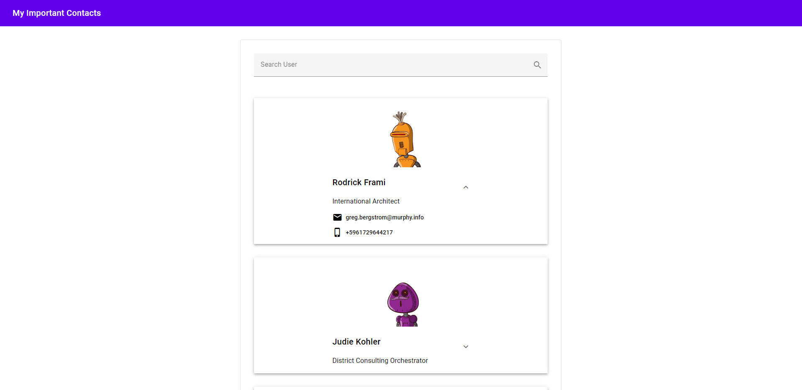

# Users_frontend

**Users_frontend is a simple React app that fetch data from a Rails API and display this data. It was built for a technical test.**



## :hammer: Built with:

- Html
- JavaScript
- React
- Material Design
- Jest
- React Testing Library

## :construction_worker: Getting Started

To get a local copy up and running follow these simple steps:

- Open the terminal where you want to clone this project and paste.

```
    git clone https://github.com/ricardomonte/users_frontend.git
```

- Access the folder cloned.

```
    cd users_frontend
```

- Install dependencies.

```
    npm install
```

- Lunch the App.

```
    npm start
```

## :heavy_check_mark: Test

For testing:

- Open in terminal the folder just cloned.
- If you run 'npm install', continue reading. If not follow the instructions in the Getting Started section
- To run the test, in the terminal run.

```
    npm run test
```

## :bust_in_silhouette: Author

- Github: [@ricardomonte](https://github.com/ricardomonte)
- Twitter: [@ramnkco](https://twitter.com/ramnkco)
- LinkedIn: [Ricardo Montenegro](https://www.linkedin.com/in/ricantomontenegro/)

## :raised_hand: :raised_hand: Contributions

Contributions, issues and feature requests are welcome!

Feel free to check the [issues here](https://github.com/ricardomonte/users_frontend/issues).

## Show your support

Give a :star: if you like this project!.

## :memo: License

This project is [MIT](LICENSE) licensed.
